<div align="center">

# AdminLTE Vue

**[AdminLTE 4](https://adminlte.io) + Bootstrap 5.3 admin dashboard for Vue 3 & Nuxt.**

45+ typed components · composables (no Pinia) · dark mode · ⌘K command palette · SSR-safe theming

[](./LICENSE)
[](https://vuejs.org)
[](https://nuxt.com)
[](https://getbootstrap.com)
[](https://www.typescriptlang.org/)

**Status:** v0.2.0 (Early Release) · **Live demo:** [adminlte.io/themes/vue-nuxt](https://adminlte.io/themes/vue-nuxt/)

</div>

<p align="center">
  <a href="https://adminlte.io/themes/vue-nuxt/">
    
  </a>
  <a href="https://adminlte.io/themes/vue-nuxt/">
    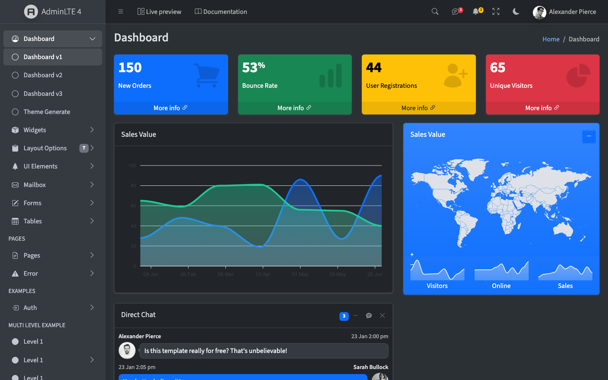
  </a>
</p>

<p align="center">
  <a href="https://adminlte.io/themes/vue-nuxt/"><strong>🔗 Live demo →</strong></a>
  &nbsp;·&nbsp;
  <a href="#quick-start--nuxt"><strong>Get started →</strong></a>
  &nbsp;·&nbsp;
  <a href="./CHANGELOG.md"><strong>Changelog →</strong></a>
</p>

A faithful Vue/Nuxt port of [AdminLTE 4](https://github.com/ColorlibHQ/AdminLTE), mirroring the
official [React](https://github.com/ColorlibHQ/adminlte-react) and
[Laravel](https://github.com/ColorlibHQ/adminlte-laravel) editions. Use the framework-agnostic
component library in **any Vue 3 app**, or drop in the **Nuxt module** for zero-config auto-imports
and SSR-safe theming — same components, same markup, only the setup differs.

## Also available for your stack

The same AdminLTE 4 dashboard, in the framework you know best — you're looking at the **Vue & Nuxt** edition:

<!-- ADMINLTE-ECOSYSTEM:START -->
<div align="center">
  <a href="https://github.com/ColorlibHQ/AdminLTE"></a>
  <a href="https://github.com/ColorlibHQ/adminlte-react"></a>
  <a href="https://github.com/ColorlibHQ/adminlte-react"></a>
  <a href="https://github.com/ColorlibHQ/adminlte-vue"></a>
  <a href="https://github.com/ColorlibHQ/adminlte-vue"></a>
  <a href="https://github.com/ColorlibHQ/adminlte-angular"></a>
  <a href="https://github.com/ColorlibHQ/adminlte-laravel"></a>
  <a href="https://github.com/ColorlibHQ/adminlte-symfony"></a>
  <a href="https://github.com/ColorlibHQ/adminlte-django"></a>
  <a href="https://github.com/ColorlibHQ/adminlte-aspnet"></a>
  <a href="https://github.com/ColorlibHQ/adminlte-drupal"></a>
  <a href="https://docs.adminlte.io"></a>
</div>
<!-- ADMINLTE-ECOSYSTEM:END -->

<p align="center">
  <a href="https://adminlte.io/themes/vue-nuxt/">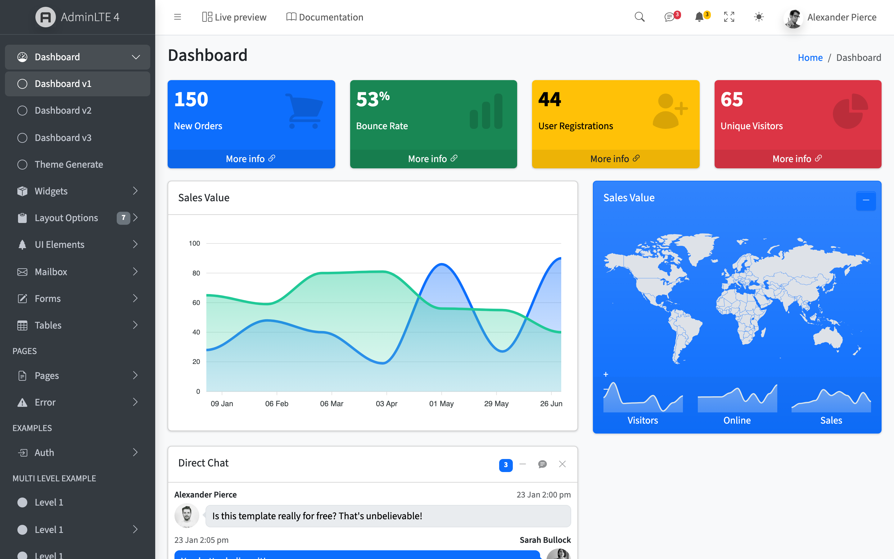</a>
</p>


> Also available as the original [AdminLTE](https://github.com/ColorlibHQ/AdminLTE) (HTML · Bootstrap 5.3 · vanilla JS — [demo](https://adminlte.io/themes/v4/)) and the legacy [AdminLTE v3](https://github.com/ColorlibHQ/AdminLTE/tree/v3) (Bootstrap 4 · jQuery — [demo](https://adminlte.io/themes/v3/)). Need a full backend and dozens more pages, not just the toolkit? See the [premium Vue & Nuxt dashboards](#premium-vue--nuxt-dashboards) below.

## Packages

This is a pnpm monorepo:

| Package | Path | Description |
| --- | --- | --- |
| [`@adminlte/vue`](./packages/adminlte-vue) | `packages/adminlte-vue` | Framework-agnostic Vue 3 component library — works in any Vite / Nuxt / Vue 3 app. |
| [`@adminlte/nuxt`](./packages/nuxt) | `packages/nuxt` | Nuxt module: auto-imports, CSS injection, Bootstrap init, SSR-safe dark mode. |
| `demo` | `apps/demo` | Nuxt 4 demo — a 1:1 clone of the official AdminLTE 4 demo, built from the library's own components. |
| `docs` | `apps/docs` | [@nuxt/content](https://content.nuxt.com) documentation site (API reference for every component & composable). |

## Features

- 🧩 **45+ components** across layout, widgets, forms, and tools — all typed with `<script setup lang="ts">`.
- 🪝 **Composables, not jQuery** — `useSidebar`, `useColorMode`, `useCardWidget`, `useFullscreen`, … via `provide`/`inject` (no Pinia).
- 🌙 **Native dark mode** through Bootstrap's `data-bs-theme`, with a blocking head script so there's no flash on SSR.
- ⌘ **Command palette** (⌘K / Ctrl+K) generated from your menu.
- 📊 **Plugin wrappers** — ApexCharts, Tabulator, Quill, Flatpickr, Tom Select, FullCalendar, jsVectorMap, SortableJS — lazy-loaded and SSR-safe.
- 📦 **No required runtime dependencies** — beyond the Vue peer; nothing extra forced into your bundle. Plugin libs are *optional* peers.
- ♿ **Accessibility** — skip links, live region, reduced-motion support out of the box.
- 🎨 **No SCSS to maintain** — styling comes from the prebuilt `admin-lte` package.

## Quick start — Nuxt

```bash
npm i @adminlte/nuxt @adminlte/vue bootstrap
```

```ts
// nuxt.config.ts
export default defineNuxtConfig({
  modules: ['@adminlte/nuxt'],
  adminlte: {
    defaults: { sidebarTheme: 'dark', fixedHeader: true, fixedSidebar: true, initialColorMode: 'auto' },
  },
  css: ['bootstrap-icons/font/bootstrap-icons.css', 'overlayscrollbars/overlayscrollbars.css'],
})
```

```vue
<!-- app/layouts/default.vue -->
<script setup lang="ts">
import type { MenuNode } from '@adminlte/vue'
const route = useRoute()
const NuxtLink = resolveComponent('NuxtLink')
const menu: MenuNode[] = [
  { type: 'item', text: 'Dashboard', href: '/', icon: 'bi-speedometer' },
  { type: 'group', text: 'Pages', icon: 'bi-files', children: [
    { type: 'item', text: 'Profile', href: '/profile' },
  ] },
]
</script>

<template>
  <LteDashboardLayout :menu-items="menu" :current-path="route.path" :link-component="NuxtLink">
    <slot />
  </LteDashboardLayout>
</template>
```

```vue
<!-- app/pages/index.vue -->
<template>
  <LteAppContent title="Dashboard">
    <div class="row">
      <div class="col-lg-3 col-6"><LteSmallBox title="150" text="New Orders" theme="primary" icon="bi-bag" url="#" /></div>
    </div>
    <LteCard title="Welcome" collapsible>It works!</LteCard>
  </LteAppContent>
</template>
```

Components and composables are auto-imported by the module — no `import` statements needed.

## Quick start — plain Vue 3 (Vite)

```bash
npm i @adminlte/vue bootstrap
```

```ts
// main.ts
import { createApp } from 'vue'
import AdminLteVue from '@adminlte/vue'
import '@adminlte/vue/css'
import 'bootstrap-icons/font/bootstrap-icons.css'
import 'bootstrap' // dropdowns/modals/offcanvas
import App from './App.vue'

createApp(App).use(AdminLteVue).mount('#app')
```

Pass `:current-path` from your router and `:link-component="RouterLink"` to `<LteDashboardLayout>`.
SSR-safety is built into the library, so this works under Vite SSR / vue-router SSR too — the Nuxt
module just automates the wiring above.

## Components

**Layout** — `LteDashboardLayout`, `LteAuthLayout`, `LteAppContent`, `LteSidebar`,
`LteSidebarBrand`, `LteSidebarNav`, `LteSidebarNavItem`, `LteSidebarOverlay`, `LteTopbar`,
`LteFooter`, `LteColorModeToggle`, `LteFullscreenToggle`

**Widgets** — `LteCard`, `LteSmallBox`, `LteInfoBox`, `LteAlert`, `LteCallout`, `LteProgress`,
`LteProgressGroup`, `LteTimeline`, `LteRatings`, `LteProfileCard`, `LteDescriptionBlock`,
`LteDirectChat`, `LteNavMessages`, `LteNavNotifications`, `LteNavTasks`, `LteToast`, `LteTabs`,
`LteTab`, `LteAccordion`, `LteAccordionItem`, `LteBreadcrumb`, `LteCommandPalette`

**Forms** — `LteButton`, `LteInput`, `LteTextarea`, `LteSelect`, `LteInputSwitch`, `LteInputColor`,
`LteInputFile`, `LteInputFlatpickr`, `LteInputTomSelect`

**Tools** — `LteModal`, `LteWizard`, `LteWizardStep`

**Plugins** (`@adminlte/vue/plugins`) — `LteApexChart`, `LteSparklineChart`, `LteDatatable`,
`LteEditor`, `LteFlatpickr`, `LteTomSelect`, `LteCalendar`, `LteVectorMap`, `LteSortable`,
`LteKanban`

## Composables

| Composable | Purpose |
| --- | --- |
| `useSidebar()` | Sidebar collapse / mobile-overlay / mini state + `toggle/collapse/expand`. |
| `useColorMode()` | `colorMode` / `resolvedMode` / `setColorMode` (light · dark · auto). |
| `useCardWidget()` | Per-card collapse / maximize / remove. |
| `useFullscreen()` | Fullscreen API wrapper. |
| `useDirectChat()` | Direct-chat contacts pane toggle. |
| `useSortable(el, opts)` | SortableJS on a ref (lazy-loaded). |
| `useCommandPalette()` | Open/close the ⌘K palette. |
| `treeviewTransition(speed)` | Height transition hooks for the sidebar treeview. |

`useSidebar` / `useColorMode` / `useCommandPalette` are provided by `<LteDashboardLayout>`.

## Screenshots

Every screenshot is a real page from the running demo — [browse the live demo →](https://adminlte.io/themes/vue-nuxt/)

<p align="center">
  <a href="https://adminlte.io/themes/vue-nuxt/index2/">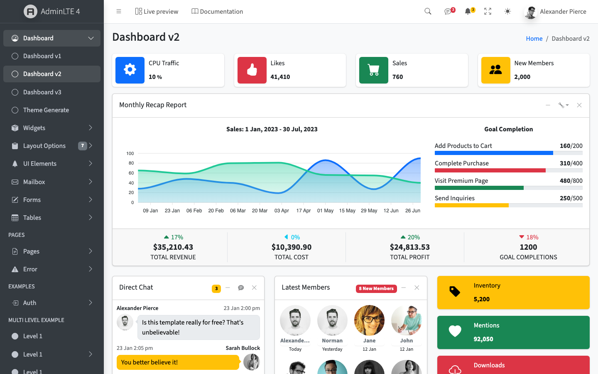</a>
  <a href="https://adminlte.io/themes/vue-nuxt/index3/">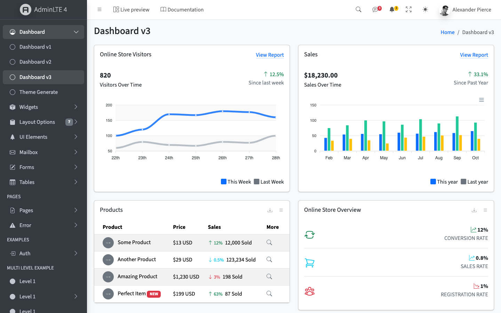</a>
  <a href="https://adminlte.io/themes/vue-nuxt/widgets/cards/">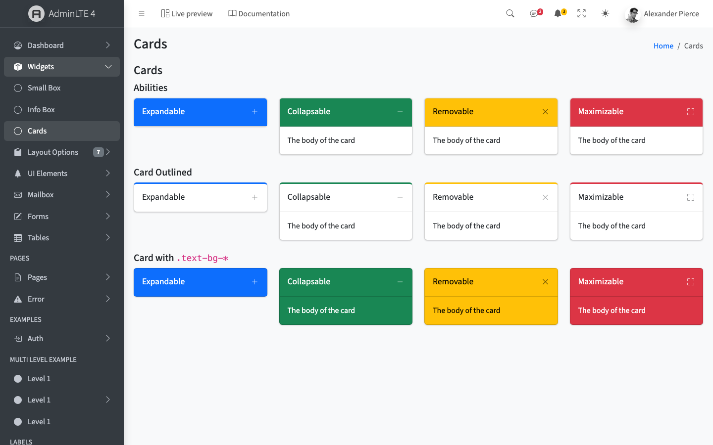</a>
</p>
<p align="center">
  <a href="https://adminlte.io/themes/vue-nuxt/forms/elements/">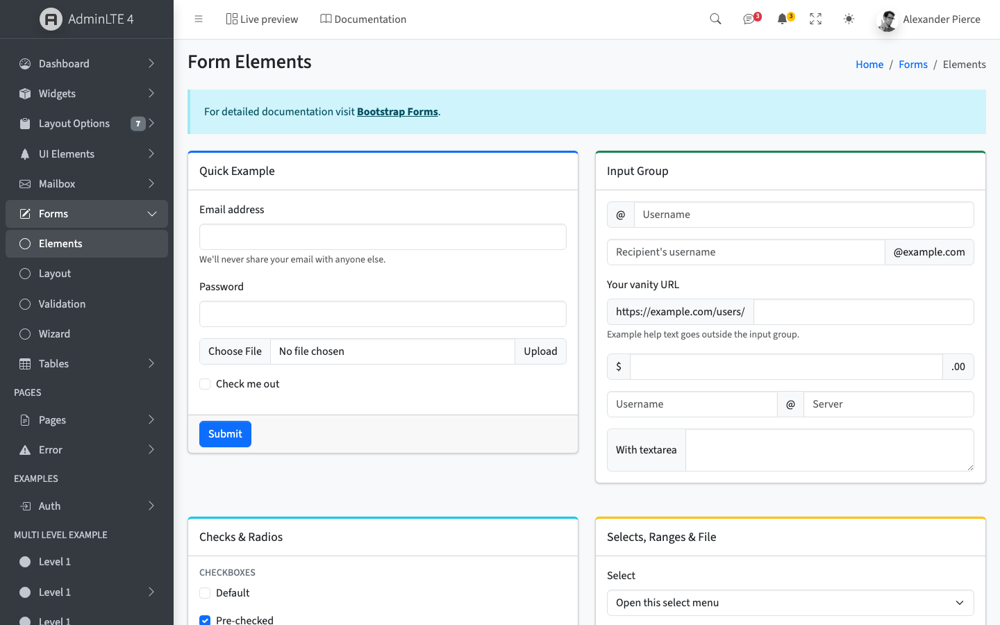</a>
  <a href="https://adminlte.io/themes/vue-nuxt/tables/data/">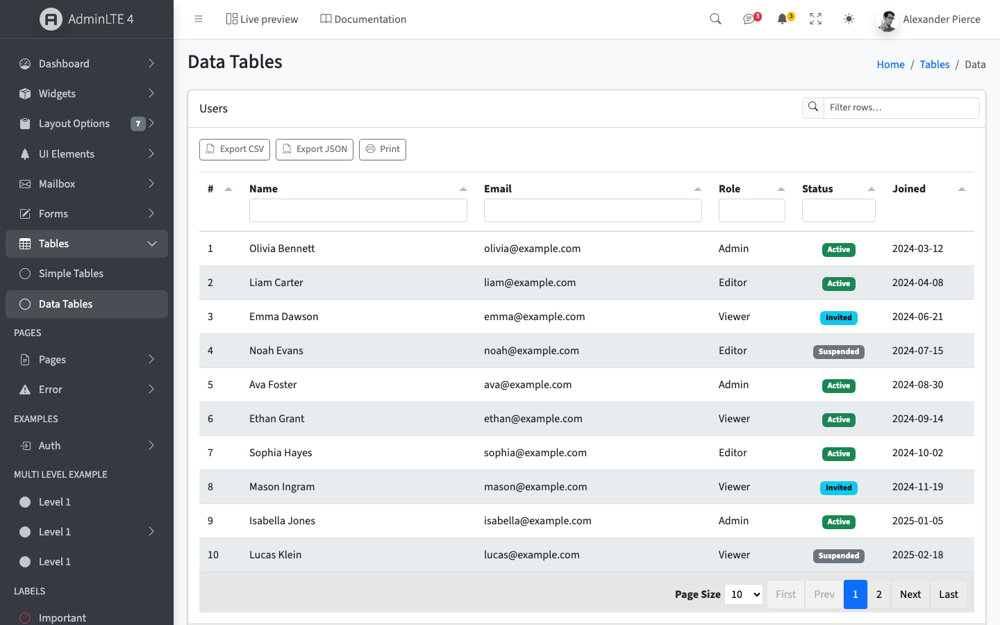</a>
  <a href="https://adminlte.io/themes/vue-nuxt/pages/kanban/">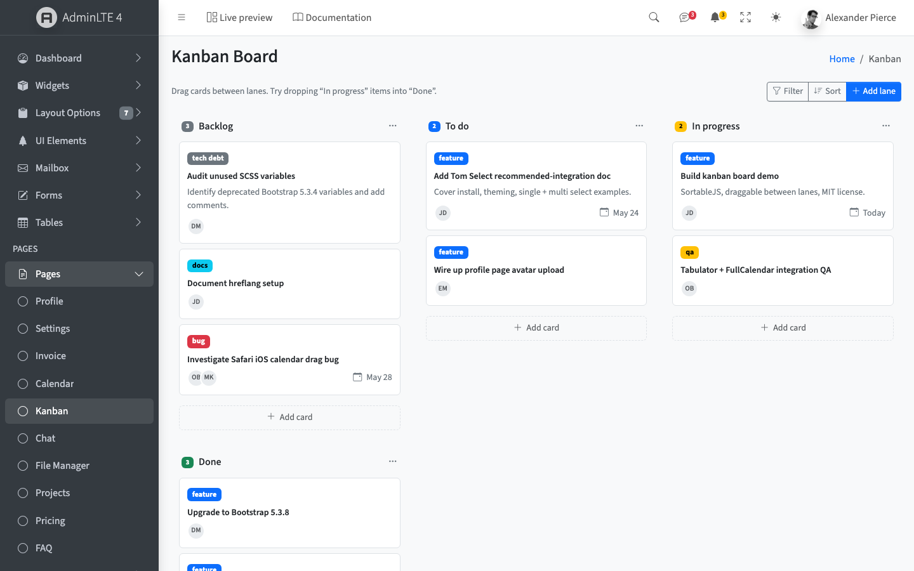</a>
</p>
<p align="center">
  <a href="https://adminlte.io/themes/vue-nuxt/pages/calendar/">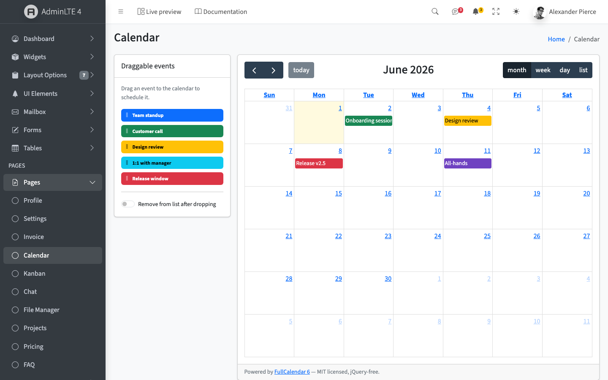</a>
  <a href="https://adminlte.io/themes/vue-nuxt/pages/chat/">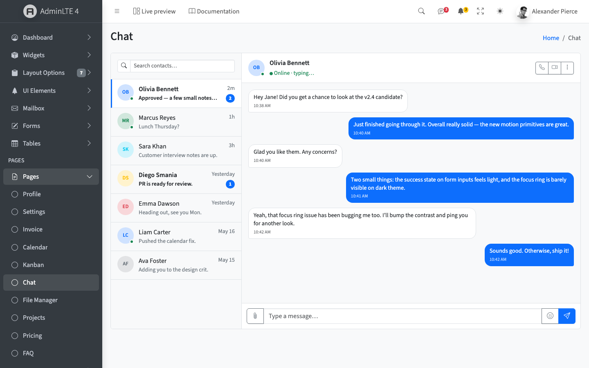</a>
  <a href="https://adminlte.io/themes/vue-nuxt/generate/theme/">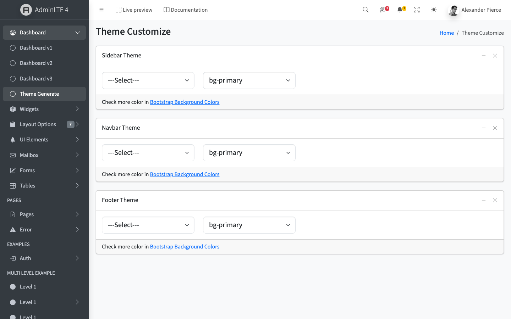</a>
</p>

## Dark mode

Dark mode toggles Bootstrap's `data-bs-theme` on `<html>` and persists the preference under the
`lte-theme` localStorage key. Under Nuxt, the module injects a blocking inline head script that sets
the attribute before first paint — **no flash of the wrong theme**. Add `<LteColorModeToggle>` (it's
already in `<LteTopbar>`) for a light/dark/auto switcher.

## Documentation

A full API reference for every component and composable — Installation, Guide (Nuxt module, color
mode, SSR-safety, routing), Components, Composables, and Resources — lives in the **docs site**
(`apps/docs`, built with [@nuxt/content](https://content.nuxt.com)):

**📖 [adminlte.io/themes/vue-nuxt/docs](https://adminlte.io/themes/vue-nuxt/docs/)** — or run it locally:

```bash
pnpm dev:docs     # http://localhost:3000/docs/
```

[CLAUDE.md](./CLAUDE.md) documents the architecture and build pipeline.

## Development

```bash
pnpm install
pnpm build        # build the library + Nuxt module (dependency order)
pnpm dev:demo     # run the demo
pnpm dev:docs     # run the docs site
```

## Browser support

Modern evergreen browsers (Chrome, Firefox, Safari, Edge). Same matrix as Bootstrap 5.3.

## Premium Vue & Nuxt Dashboards

This library is free and MIT-licensed. When you need a **production dashboard with a real backend,
many more pages, and dedicated support** — server-driven CRUD, authentication, role-based access,
and dozens of polished screens out of the box — these commercial **Vue & Nuxt** editions from
[DashboardPack](https://dashboardpack.com/?utm_source=github&utm_medium=readme&utm_campaign=adminlte-vue)
pick up where the free toolkit leaves off.

<table>
  <tr>
    <td align="center" width="50%">
      <a href="https://dashboardpack.com/theme-details/haze-dashboard-nuxt/?utm_source=github&utm_medium=readme&utm_campaign=adminlte-vue">
        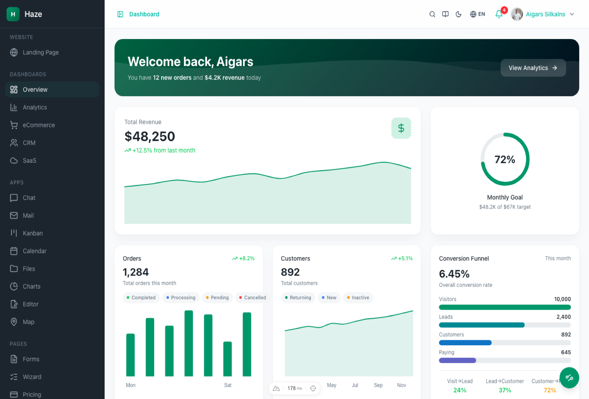
      </a>
      <br>
      <a href="https://dashboardpack.com/theme-details/haze-dashboard-nuxt/?utm_source=github&utm_medium=readme&utm_campaign=adminlte-vue"><strong>Haze — Nuxt</strong></a>
      <br>
      <sub>Nuxt 4 + Vue 3 + Nuxt UI v4 + Tailwind CSS v4. 92+ pages, 7 layouts, 5 dashboards, full CRUD with a mock API, i18n, RTL, live theme customizer.</sub>
    </td>
    <td align="center" width="50%">
      <a href="https://dashboardpack.com/theme-details/architectui-dashboard-vue-pro/?utm_source=github&utm_medium=readme&utm_campaign=adminlte-vue">
        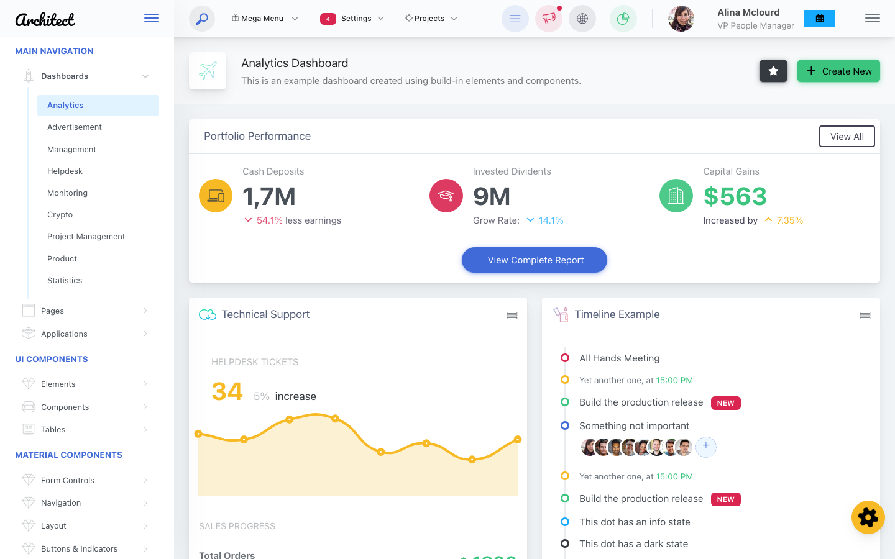
      </a>
      <br>
      <a href="https://dashboardpack.com/theme-details/architectui-dashboard-vue-pro/?utm_source=github&utm_medium=readme&utm_campaign=adminlte-vue"><strong>ArchitectUI — Vue Pro</strong></a>
      <br>
      <sub>Vue 3.5 + Vuetify 4 (Material Design 3) + Vite 7 + Pinia. 9 dashboard layouts, 50+ components, 9 color schemes, dark mode.</sub>
    </td>
  </tr>
  <tr>
    <td align="center" width="50%">
      <a href="https://dashboardpack.com/theme-details/apex-dashboard-nextjs/?utm_source=github&utm_medium=readme&utm_campaign=adminlte-vue">
        
      </a>
      <br>
      <a href="https://dashboardpack.com/theme-details/apex-dashboard-nextjs/?utm_source=github&utm_medium=readme&utm_campaign=adminlte-vue"><strong>Apex Dashboard — Next.js</strong></a>
      <br>
      <sub>Next.js 16 + React 19 + Tailwind CSS v4 + shadcn/ui. 5 dashboard variants, 20+ app pages, 125+ routes, full CRUD.</sub>
    </td>
    <td align="center" width="50%">
      <a href="https://dashboardpack.com/theme-details/admindek-html/?utm_source=github&utm_medium=readme&utm_campaign=adminlte-vue">
        
      </a>
      <br>
      <a href="https://dashboardpack.com/theme-details/admindek-html/?utm_source=github&utm_medium=readme&utm_campaign=adminlte-vue"><strong>Admindek — HTML</strong></a>
      <br>
      <sub>Bootstrap 5 + vanilla JS. 100+ components, dark/light modes, RTL support, 10 color presets.</sub>
    </td>
  </tr>
</table>

<sub>Prefer the official AdminLTE-branded premium themes? Browse <a href="https://adminlte.io/premium?utm_source=github&utm_medium=readme&utm_campaign=adminlte-vue">AdminLTE Premium</a>.</sub>

<p align="center">
  <a href="https://dashboardpack.com/?utm_source=github&utm_medium=readme&utm_campaign=adminlte-vue"><strong>View All Premium Templates →</strong></a>
</p>

## Contributing

Issues and PRs welcome. After changes, run `pnpm --filter adminlte-vue type-check`,
`pnpm --filter adminlte-vue test`, `pnpm lint`, and `pnpm build:demo` (the SSR/hydration gate). See
[CLAUDE.md](./CLAUDE.md) for where things live and the three touch-points for adding a component.

## License

[MIT](./LICENSE) — like AdminLTE itself. © [Colorlib](https://colorlib.com)

## Resources

- [AdminLTE](https://adminlte.io) · [GitHub](https://github.com/ColorlibHQ/AdminLTE)
- [adminlte-react](https://github.com/ColorlibHQ/adminlte-react) · [adminlte-laravel](https://github.com/ColorlibHQ/adminlte-laravel)
- [Vue 3](https://vuejs.org) · [Nuxt](https://nuxt.com) · [Bootstrap 5.3](https://getbootstrap.com)

## Support

- [GitHub Issues](https://github.com/ColorlibHQ/adminlte-vue/issues)
- [GitHub Discussions](https://github.com/ColorlibHQ/adminlte-vue/discussions)
